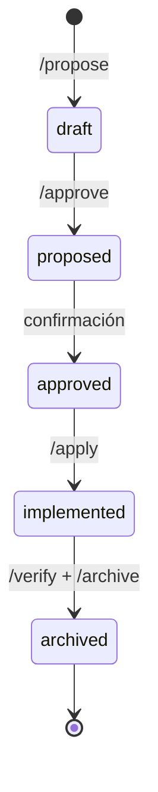

> [!IMPORTANT]
> Este repositorio es una **exhibición arquitectónica** de Forge. El código fuente es privado y no está incluido aquí.
> Para más información sobre el autor, visita [github.com/Bajmein](https://github.com/Bajmein).

# Forge


> [!IMPORTANT]
> Este repositorio es una **exhibición arquitectónica** de Forge. El código fuente es privado y no está incluido aquí.
> Para más información sobre el autor, visita [github.com/Bajmein](https://github.com/Bajmein).

## Acerca del Proyecto

Forge es un proyecto experimental que explora el desarrollo dirigido por especificaciones (Spec-Driven Development - SDD). El objetivo es crear un pipeline de desarrollo donde cada cambio esté respaldado por artefactos formales que guíen a los agentes de IA durante el proceso de implementación.

El sistema busca estructurar la evolución de proyectos personales mediante un flujo de trabajo claro, donde cada paso - desde la idea hasta el despliegue - es verificable.

---

## Spec-Driven Development (SDD)

Forge implementa un ciclo de vida donde cada cambio pasa por artefactos formales antes de llegar al código.



Cada nodo representa una fase: el **Usuario** inicia el cambio, la **Especificación** lo formaliza, los **artefactos formales** guían la ejecución, el **Agente IA** lo ejecuta, y el **Output** retroalimenta el proyecto.

---

## Garantías Formales

### Schema de Propuesta

```yaml
type: proposal
domain: <área del sistema>
status: proposed | approved
author: <model-id>
created_at: YYYY-MM-DD
```

### Schema de Especificación

```markdown
#### Scenario: <nombre del escenario>

**GIVEN** <precondición del sistema>
**WHEN** <acción que se ejecuta>
**THEN** <resultado esperado verificable>
```

### Validación

Todos los artefactos se validan formalmente contra sus respectivos schemas y reglas de negocio utilizando comandos específicos antes de avanzar a la siguiente fase.

---

## Aislamiento por Worktree

Cada cambio se desarrolla en un entorno completamente aislado. Durante el proceso, se crea un `git worktree` dedicado específicamente a ese cambio, aislando las dependencias. Una vez que el cambio es exitoso, el worktree se elimina automáticamente.

---

## Stack Tecnológico

| Componente | Tecnología |
|---|---|
| Artefactos | Markdown + YAML frontmatter |
| Desarrollo | Python 3.14+, mise, uv, dprint |
| Validación | pytest, ruff, bandit, ty, deptry, vulture |
| MCP Servers | Context7, Serena, Obsidian, GitHub |
| Clientes IA | Claude Code, Gemini CLI |

---

## Estado

**v0.1.0** — Pipeline SDD completo y operativo. Fases `propose → archive` implementadas.

## Contacto

[kenno13@proton.me](mailto:kenno13@proton.me)

## Licencia

El código fuente de Forge es privado. Los artefactos de este repositorio se comparten con fines de exhibición arquitectónica.
