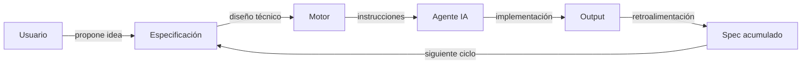

 > [!IMPORTANT]
> Este repositorio es una **exhibición arquitectónica** de Forge. El código fuente es privado y no está incluido aquí.
> Para más información sobre el autor, visita [github.com/Bajmein](https://github.com/Bajmein).

# Forge

Pipeline de desarrollo dirigido por especificaciones (SDD) para proyectos de software personales.

## Spec-Driven Development (SDD)

Forge implementa un ciclo de vida donde cada cambio pasa por artefactos formales antes de llegar al código.

Cada nodo del diagrama representa una fase obligatoria: el **Usuario** inicia el cambio, la **Especificación** lo formaliza, el **Motor** lo descompone en tareas, el **Agente IA** lo ejecuta, y el **Output** retroalimenta el spec acumulado del proyecto.

## Arquitectura de Conocimiento

| Sistema | Rol | Contenido |
|---|---|---|
| Notion | Gestión de proyectos | Roadmap, tareas, backlog |
| Obsidian | Base de conocimiento | ADRs, decisiones, contexto |
| Filesystem | Artefactos del pipeline | Specs, diseños, tasks, changesets |

## Flujo de Comandos (Slash CLI)

| Comando | Fase | Descripción |
|---|---|---|
| `/propose` | Propuesta | Redactar propuesta para una nueva idea |
| `/specify` | Especificación | Crear spec delta a partir de propuesta aprobada |
| `/design` | Diseño | Generar diseño técnico desde spec aprobado |
| `/break-to-tasks` | Planificación | Descomponer diseño en lista de tareas ordenadas |
| `/approve` | Aprobación | Marcar propuesta como aprobada |
| `/apply` | Implementación | Ejecutar las tareas definidas en el changeset |
| `/verify` | Verificación | Verificar que el cambio cumple spec, diseño y tasks |
| `/archive` | Cierre | Archivar cambio completado y mergear spec al acumulado |
| `/fast-draft` | Atajo | Propuesta + spec en una sola pasada |
| `/fast-plan` | Atajo | Diseño + tasks en una sola pasada |

## Stack

| Componente | Tecnología |
|---|---|
| Artefactos | Markdown + YAML frontmatter |
| Desarrollo | Python 3.14+, mise, uv |
| Validación | pytest, ruff, bandit, ty, deptry |
| MCP Servers | Context7, Serena, Obsidian, GitHub |
| Clientes IA | Claude Code (Anthropic), Gemini CLI (Google) |

## Estado

**v0.1.0** — Pipeline SDD completo y operativo. Fases `propose → archive` implementadas. Integración con Notion y expansión a más CLIs en progreso.

## Licencia

El código fuente de Forge es privado. Los artefactos de este repositorio (documentación, topología, configuración de referencia) se comparten con fines de exhibición arquitectónica.
